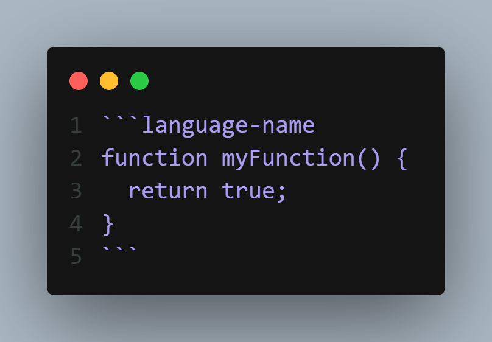
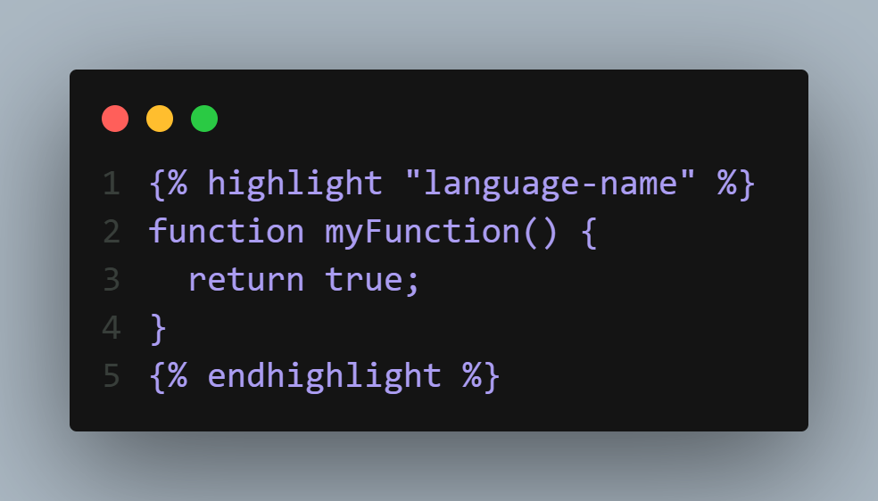

# BLEU Community Blog

A minimalistic, open-source blog platform for the BLEU tech community. Built with [Eleventy](https://www.11ty.dev/) & hosted on GitHub Pages.

## Quick Start

### Local Development

```bash
# Install dependencies
npm install

# Start dev server (with hot reload)
npm run dev

# Build for production
npm run build
```

### Submit a Blog

See [CONTRIBUTING.md](./CONTRIBUTING.md) for detailed instructions.

TL;DR:
1. Fork this repo
2. Add `content/blogs/your-post.md`
3. Open a PR
4. Get reviewed & merged
5. Published! 🎉

## Project Structure

```
BLEU-Website/
├── content/blogs/       # Markdown blog posts
├── src/
│   ├── _data/           # Site data & Discord stats
│   ├── _includes/       # Layouts & components
│   ├── assets/          # CSS, JS, images
│   └── *.njk            # Page templates
├── .eleventy.js         # Eleventy config
└── package.json
```

## Tech Stack

- **[Eleventy](https://www.11ty.dev/)** - Static site generator
- **[Tailwind CSS](https://tailwindcss.com/)** - Styling
- **[giscus](https://giscus.app/)** - Comments via GitHub Discussions
- **[GitHub Actions](https://github.com/features/actions)** - CI/CD
- **[GitHub Pages](https://pages.github.com/)** - Hosting

---

## Markdown Feature Support

This documentation outlines the Markdown features supported by our blog. Each feature includes the proper syntax and examples for clarity.


### Headings

Create headings using the hash (`#`) symbol followed by a space. The number of hashes determines the level.

```
# Heading 1
## Heading 2
### Heading 3
#### Heading 4
```

---

### Emphasis

You can add emphasis using asterisks (`*`) or underscores (`_`).

- **Bold:** Wrap text with two asterisks or two underscores.
  
  ```md
  **This is bold text** __This is also bold text__
  ```

- *Italic:* Wrap text with one asterisk or one underscore.
  
  ```md
  *This is italic text* _This is also italic text_
  ```

- ***Bold and Italic:*** Wrap text with three asterisks or three underscores.
  
  ```md
  ***This is bold and italic text*** ___This is also bold and italic text___
  ```

---

### Blockquotes

Create blockquotes by prefixing lines with a greater-than symbol.

```md
> This is a blockquote.
> It can span multiple lines if you prefix each line.
```

---

### Lists

#### Unordered Lists

Use `-`, `*`, or `+`.

```md
- Item one
- Item two
  - Nested item
```

#### Ordered Lists

Use numbers followed by a period.

```md
1. First item
2. Second item
   1. Nested ordered item
```

---

### Code Blocks

Our blog supports two methods for writing code blocks.

#### 1. Standard Markdown Syntax

Use three backticks and specify the language:





#### 2. Nunjucks Syntax



#### Supported Languages

Use the correct language tag to display the proper label.

| Tag to Type | Displayed Label |
| ----------- | --------------- |
| js          | JS              |
| ts          | TS              |
| html        | HTML            |
| css         | CSS             |
| json        | JSON            |
| python      | Python          |
| php         | PHP             |
| bash        | Bash            |
| sql         | SQL             |
| java        | JAVA            |
| rust        | RUST            |
| cpp         | C++             |
| c           | C               |
| csharp      | C#              |
| diff        | DIFF            |
| example     | example         |
---


### Horizontal Rule

Create a horizontal rule using three or more hyphens:

```md
---
```

--- 

### Links

```md
[Visit our homepage](https://example.com/)
```

---

### Images

```md

```
---


### Characters You Can Escape

Characters You Can Escape
Prefix characters with a backslash \ to prevent formatting.


| Character | Name |
|-----------|------|
| \\        | backslash |
| \`        | backtick |
| \*        | asterisk |
| \_        | underscore |
| \{ \}     | curly braces |
| \[ \]     | brackets |
| \< \>     | angle brackets |
| \( \)     | parentheses |
| \#        | pound sign |
| \+        | plus sign |
| \-        | minus sign |
| \.        | dot |
| \!        | exclamation mark |
| \|        | pipe |

---

### Tables

#### Standard Table
```md
| Header 1 | Header 2 | Header 3 |
|----------|----------|----------|
| Cell 1   | Cell 2   | Cell 3   |
| Cell 4   | Cell 5   | Cell 6   |
```
---

#### Table with Alignment
```md
| Left Aligned | Center Aligned | Right Aligned |
|:-------------|:--------------:|---------------:|
| Left text    | Center text    | Right text     |
| Data         | Data           | Data           |
```
---
## License

MIT © BLEU Community

---

**Build • Learn • Explore • Unite**
